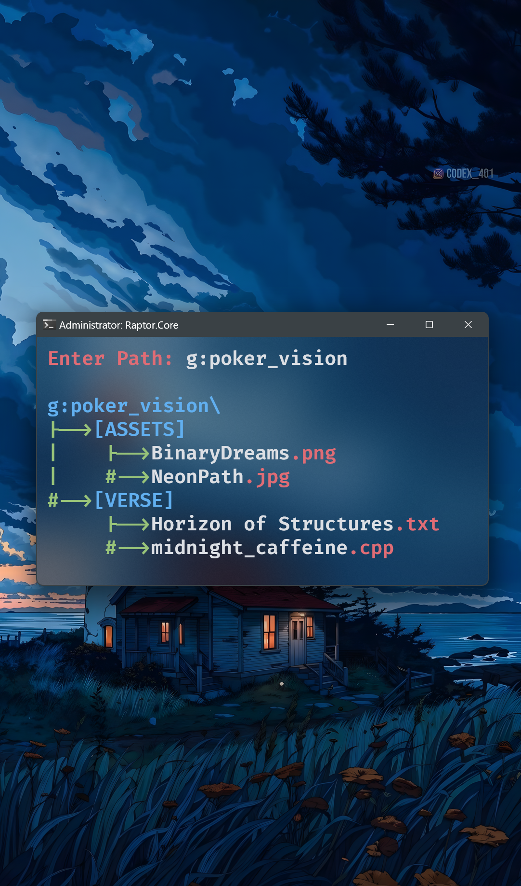

# 🎴 MiniPOKER v1.0 — Lightweight File Structure Preview Tool

[](LICENSE)
[](https://github.com/BinaryOxide/miniPOKER)
[]()

---

## 📝 About MiniPOKER

**MiniPOKER** is a **lightweight, console-based C++ application** that allows developers, students, and creators to **instantly visualize directory structures** in a clean, color-coded tree format.  

Think of it as an **enhanced `tree` command**, designed for **documentation, collaboration, and AI-assisted project analysis**.

> *“Understand any project at a glance, without opening hundreds of files.”*

---

## 🖼 Preview

<p align="center">
  
</p>

---

## 🚀 Features

| Feature | Description |
|---------|-------------|
| **Directory Tree Preview** | Generates a clear, hierarchical view of any folder path. |
| **Color-Coded Output** | Differentiates folders, files, and extensions. |
| **Lightweight & Fast** | Pure C++ code, zero external dependencies. |
| **Documentation Ready** | Ideal for README.md, reports, or slides. |
| **Windows Terminal / Command Prompt** | Runs directly in Windows terminal without extra setup. |

---

## 🛠 Installation

1. Download the **[`miniPokerSetup.exe`](https://github.com/BinaryOxide/miniPOKER/releases)** from the Releases page.  
2. Run the installer and follow the instructions.  
3. Open **Command Prompt** or **Windows Terminal**.  
4. Run the command:

```bash
minipoker


Enter Path: "H:\programming\projects\miniPOKER"

miniPOKER\
│-->[.vs]
│-->[src]
│    ├── main.cpp
│    ├── resource.h
│    └── Resource.rc
│-->[x64]
│    └── [Release]
│        └── miniPOKER.exe
│-->README.md
│-->LICENSE
│-->setup.iss
│-->setup.exe
