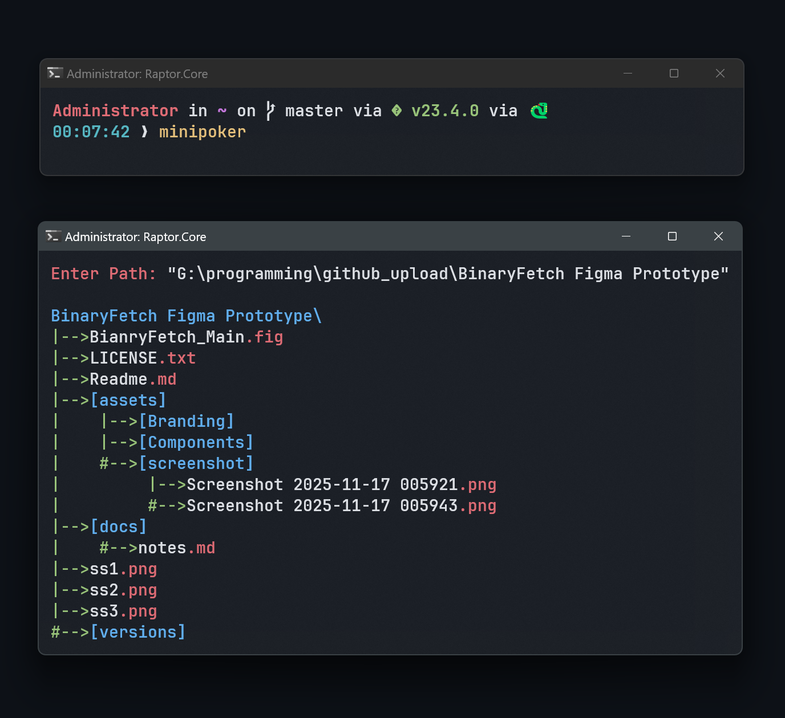

# BinaryOxide MiniPOKER

**🎮 Free for Everyone | Source Code Restricted**

BinaryOxide MiniPOKER is a free software/product developed by **Maruf Hasan**. You can use and share the compiled software freely, including for commercial purposes.

However, the **source code is proprietary** and **cannot be shared, modified, or redistributed** without explicit written permission from the author.

---

## ⚡ Features
- Lightweight and fast
- Easy-to-use interface
- Designed for personal and professional use
- Regular updates and improvements

---

## 📥 Download
You can download the **compiled binaries** from the [Releases](https://github.com/Binaryoxide/miniPOKER/releases) section.

---

## 📜 License
The software/product is distributed under the **BinaryOxide Personal/Non-Commercial License (BPNC 1.1)**:

- Product is **free for everyone**  
- **Source code is restricted** and not open-source  
- Redistribution of binaries is allowed, source code redistribution is prohibited

For full license details, see [LICENSE](./LICENSE).

---

## ✉️ Contact / Source Code Requests
If you need access to the source code for commercial use or collaboration, contact:  
- **GitHub Issues:** [https://github.com/Binaryoxide/miniPOKER/issues](https://github.com/Binaryoxide/miniPOKER/issues)  
- **Email:** 2009marufhasanpersonal@gmail.com

---

## ⚠️ Disclaimer
The software is provided “as-is” without warranty. The author is not liable for any damages arising from the use of this software.
